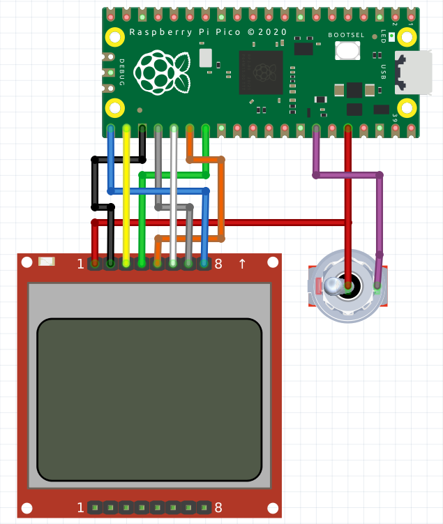

# Hardware Boot Selection Switch Using Raspberry Pi PICO

Inspired by Hackaday.io project(https://hackaday.io/project/179539-hardware-boot-selection-switch) and forked
from [here](https://github.com/MadRajib/hardware_boot_selection_switch).

This project uses the [Nokia 5110](https://github.com/viduraembedded/Raspberry-Pi-Pico/Nokia5110) library for LCD
graphics, [TinyUSB](tinyusb.org) for MSC, CDC and HID usb configuration. And It works only if you have A linux OS or
GRUB.

Also, I've added HID configuration if you want to add keyboard, mouse or Joystick macros.

```c
static void send_hid_report(uint8_t report_id, uint32_t btn){
    ...
}
```

## Schematic



## About the UI

### Stencil


- Temp: Rasberry Pico integrated temp sensor.
- Cfg Os: Is the current OS in `switch.cfg` file (0 is for Ubuntu, 1 is for Win-10)
- NextOs: Is the current status from the switch
- Status: Mounted , Unmounted , Suspended 


## Make the project

```bash
$ git clone this project
$ cd HardwareBootSelector
$ mkdir build
$ cd build
$ cmake ..
$ make
```

Now Copy the pico_msd.uf2 file to pico.

### In Ubuntu edit the grub file:

```bash
$ sudo vim /etc/grub.d/40_custom

# Look for hardware switch device by its hard-coded filesystem ID
search --no-floppy --fs-uuid --set hdswitch 0000-1234
# If found, read dynamic config file and select appropriate entry for each position
if [ "${hdswitch}" ] ; then
  source ($hdswitch)/switch.cfg

  if [ "${os_hw_switch}" == 0 ] ; then
    # Boot Linux
    set default="0"
  elif [ "${os_hw_switch}" == 1 ] ; then
    # Boot Windows
    set default="2"
  # If you have more than 2 Bootable OS add more elif statements
  else
    # Fallback to default
    set default="${GRUB_DEFAULT}"
  fi

else
  set default="${GRUB_DEFAULT}"
fi

```

## TODO:
- Read current System temperature by CDC
- Use multicore approach for reading pc info
- Use [OpenHardwareMonitor](http://openhardwaremonitor.org/)[.](https://github.com/openhardwaremonitor) for reading System info.
- Update this Readme.md