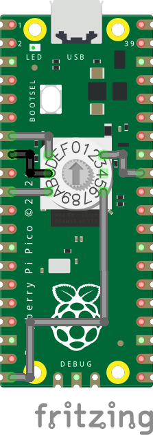

# Hardware Boot Selection Switch Using Raspberry Pi PICO

This project is inspired by the Hackaday.io initiative: [Hardware Boot Selection Switch](https://hackaday.io/project/179539-hardware-boot-selection-switch).

When working with multiple operating systems, such as Ubuntu 22.04, Windows, or other Linux distributions, it's common to have a dedicated SSD for each. Generally, the GRUB bootloader handles letting you choose the operating system when you turn on your machine. However, this process can become tedious if you do it frequently.

The need for a **more efficient and automated operating system selection** gave birth to this project. Fortunately, you're not alone with this concern. While other solutions exist, this one is particularly economical, requiring only a **Raspberry Pi Pico (RP2040)** and a **switch** (two-position or more).

------

## Suggested Hardware Components

- **Raspberry Pi Pico (RP2040)**: The [WaveShare RP2040-Zero](https://www.google.com/search?q=https://www.waveshare.com/product/rp2040-zero) version is recommended for its compact form factor and USB-C port.
- **2 or N-Position Selector Switch**: Here I experiment with a 10-position selector (MCS-RM3HAF-10R), which I configure as desired..

------

## Proposed Circuit Diagram




------

## Build This Project

Follow these steps to compile the firmware:

```Bash
$ git clone https://github.com/carlosbravo1408/HardwareBootSelector.git
$ cd HardwareBootSelector

$ mkdir build
$ cd build
$ cmake ..
$ make
```

Once compiled, copy the `pico_msd.uf2` file to your Raspberry Pi Pico while it's in Boot Mode.

------

## GRUB Configuration

For GRUB to detect and utilize the hardware switch, you need to modify its configuration.

### 1. Create or Modify `40_custom`

First, open the `/etc/grub.d/40_custom` file with the following command:

```Bash
sudo nano /etc/grub.d/40_custom
```

Paste the following content into the file:

```Bash
#!/bin/sh
exec tail -n +3 $0
# This file provides an easy way to add custom menu entries.  Simply type the
# menu entries you want to add after this comment.  Be careful not to change
# the 'exec tail' line above.
# Look for hardware switch device by its hard-coded filesystem ID
search --no-floppy --fs-uuid --set hdswitch 0000-1234
# If found, read dynamic config file and select appropriate entry for each position
if [ "${hdswitch}" ] ; then
  source ($hdswitch)/switch.cfg

  if [ "${os_hw_switch}" == 0 ] ; then
    # Boot Linux
    set default="0"
  elif [ "${os_hw_switch}" == 1 ] ; then
    # Boot Windows
    set default="2"
  # If you have more than 2 Bootable OS add more elif statements
  else
    # Fallback to default
    set default="${GRUB_DEFAULT}"
  fi

else
  set default="${GRUB_DEFAULT}"
fi
```

**Note**: `os_hw_switch` with value `0` corresponds to the first operating system in your GRUB list (usually Linux), and `1` to the second (Windows in this example). Adjust these values (`set default="X"`) according to the order of your operating systems in the GRUB menu. If you have more than two systems, you can add more `elif` blocks.

### 2. Update GRUB

After saving the file, run the following command to apply the changes:

```Bash
sudo update-grub
```

### 3. Enable `os-prober` (if Windows doesn't appear)

If your Windows partition or image doesn't appear in the list of operating systems at boot, it's likely that the `os-prober` option is disabled in Ubuntu 22.04 and later. To enable it, open the `/etc/default/grub` file:

```Bash
sudoedit /etc/default/grub
```

Find the line `#GRUB_DISABLE_OS_PROBER` and change it to `GRUB_DISABLE_OS_PROBER="false"`. If it doesn't exist, add it.

```Bash
# If you change this file, run 'update-grub' afterwards to update
# /boot/grub/grub.cfg.
# For full documentation of the options in this file, see:
#   info -f grub -n 'Simple configuration'
...
# Uncomment to get a beep at grub start
#GRUB_INIT_TUNE="480 440 1"
GRUB_DISABLE_OS_PROBER="false"
```

Save the changes and run `sudo update-grub` again.

